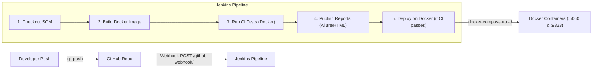

# Jenkins CI/CD Pipeline & GitHub Webhook Setup Guide

This guide walks you through integrating **Jenkins** with your GitHub repository to automatically trigger Playwright tests in **Docker** upon code push, archive test reports, and deploy containers on Docker when the tests pass.

---

## 1. Architecture Overview



---

## 2. Prerequisites

1. **Jenkins Server** installed and running (Linux or Windows).
2. **Docker & Docker Compose** installed on the Jenkins host machine.
3. **Jenkins Docker permissions**:
   - On Linux, add the `jenkins` user to the `docker` group:
     ```bash
     sudo usermod -aG docker jenkins
     sudo systemctl restart jenkins
     ```
   - On Windows, ensure Docker Desktop is running and accessible from the user account running Jenkins.

---

## 3. Install Required Jenkins Plugins

1. Go to **Dashboard** $\rightarrow$ **Manage Jenkins** $\rightarrow$ **Plugins** $\rightarrow$ **Available plugins**.
2. Search and install the following plugins:
   - **GitHub Integration Plugin** (for GitHub webhook handling)
   - **HTML Publisher Plugin** (for publishing the Playwright HTML report)
   - **Allure Jenkins Plugin** (for rendering interactive Allure reports)
   - **AnsiColor Plugin** (for colorized console logs)
3. Restart Jenkins if prompted.

### Configure Allure Commandline in Jenkins (Optional but Recommended)
1. Go to **Manage Jenkins** $\rightarrow$ **Tools**.
2. Scroll to **Allure Commandline Installations** $\rightarrow$ Click **Add Allure Commandline**.
3. Name: `allure`
4. Check **Install automatically** $\rightarrow$ Select latest version $\rightarrow$ Click **Save**.

---

## 4. Setup GitHub Webhook

To allow GitHub to automatically notify Jenkins when code is pushed:

1. Open your repository on GitHub: `https://github.com/<username>/<repo>`.
2. Go to **Settings** $\rightarrow$ **Webhooks** $\rightarrow$ Click **Add webhook**.
3. Configure the webhook settings:
   - **Payload URL**: `http://<YOUR_JENKINS_IP_OR_DOMAIN>:8080/github-webhook/`  
     *(Note: If testing locally on localhost, use [ngrok](https://ngrok.com/) to expose Jenkins: `ngrok http 8080`)*
   - **Content type**: `application/json`
   - **Secret**: *(Leave empty unless configured in Jenkins GitHub plugin)*
   - **Which events would you like to trigger this webhook?**: Select **Just the push event**.
   - **Active**: Ensure the checkbox is checked.
4. Click **Add webhook**. GitHub will send a test ping. A green checkmark indicates a successful connection.

---

## 5. Create the Jenkins Pipeline Job

1. Go to Jenkins **Dashboard** $\rightarrow$ Click **New Item**.
2. Enter a job name (e.g., `SauceDemo-Automation-CI-CD`), select **Pipeline**, and click **OK**.
3. In the job configuration:
   - Scroll to **Build Triggers**:
     - Check **GitHub hook trigger for GITScm polling**.
   - Scroll to **Pipeline**:
     - **Definition**: Select **Pipeline script from SCM**.
     - **SCM**: Select **Git**.
     - **Repository URL**: Paste your GitHub repository URL (e.g., `https://github.com/<user>/SauceDemo-Automation.git`).
     - **Credentials**: Add your GitHub Personal Access Token or SSH credentials if the repository is private.
     - **Branch Specifier**: `*/main` (or `*/master` depending on your default branch).
     - **Script Path**: `Jenkinsfile`.
4. Click **Save**.

---

## 6. Pipeline Execution Stages Explained

| Stage | Description |
| :--- | :--- |
| **1. Checkout SCM** | Clones the latest commit pushed to the GitHub repository. |
| **2. Build Docker Images** | Runs `docker compose build` to package the app, Playwright dependencies, and test scripts into `saucedemo-automation:latest`. |
| **3. Run CI Tests** | Executes `docker compose up --exit-code-from playwright-tests playwright-tests`. Runs all 47 tests (UI & API) in a headless container. |
| **4. Publish Reports** | Archives failure screenshots and renders both the Playwright HTML report and the interactive Allure report inside the Jenkins build dashboard. |
| **5. Deploy on Docker** | **Executes only when tests pass (`SUCCESS`)**: Runs `docker compose up -d allure-report playwright-report` to deploy live reporting dashboards. |

---

## 7. Accessing Deployed Reports

Once a build passes and is deployed to Docker:

- **Allure Interactive Dashboard**:  
  `http://<SERVER_IP>:5050`
- **Playwright HTML Report Server**:  
  `http://<SERVER_IP>:9323`
- **Inside Jenkins**:  
  Access the build artifacts directly via the **Allure Report** and **Playwright HTML Report** links on the left sidebar of the job run.

---

## 8. Troubleshooting & Common Issues

- **Docker Permission Denied on Jenkins**:
  Run `sudo usermod -aG docker jenkins` and restart the Jenkins service.
- **GitHub Webhook not reaching Jenkins (Localhost)**:
  Use ngrok: `ngrok http 8080`, then set your payload URL to `https://<ngrok-id>.ngrok-free.app/github-webhook/`.
- **Ports 5050 or 9323 already in use**:
  Update the port bindings in [`docker-compose.yml`](file:///c:/Users/SP23BSCS0013-NAJMURR/Desktop/SauceDemo-Automation/docker-compose.yml#L24) to any free ports on your host machine.

